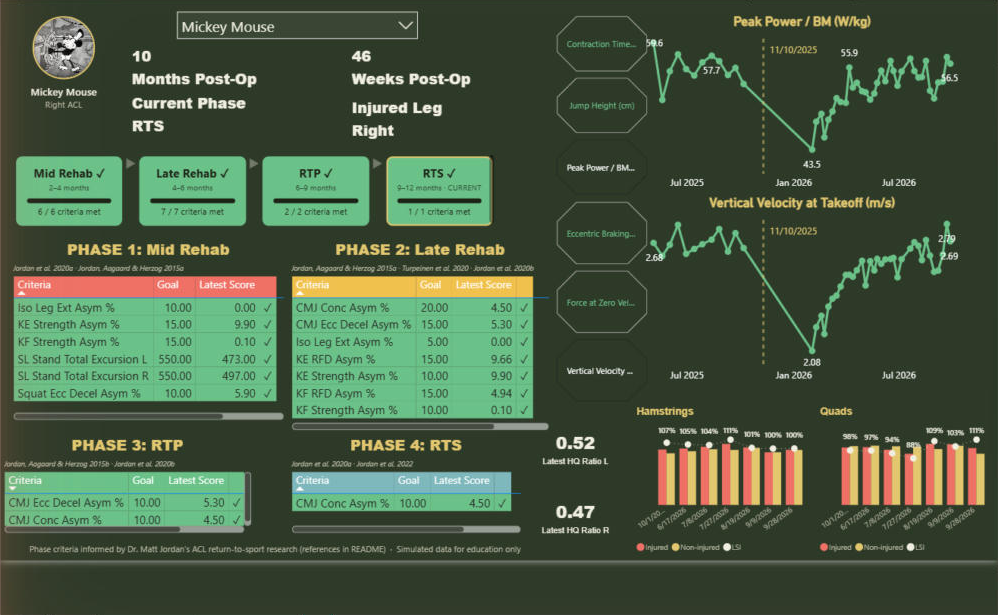
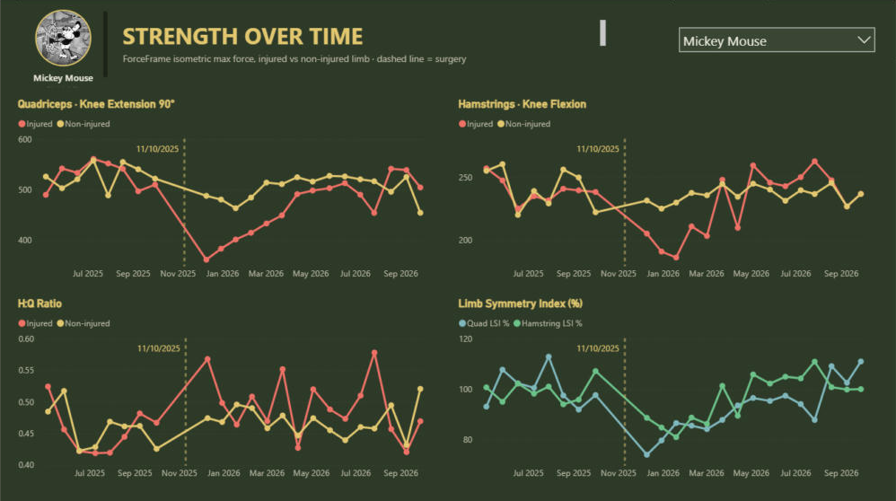

# ACL RTS Tracker (Power BI)



A Power BI dashboard for tracking athletes through return to sport (RTS) after ACL reconstruction. It reads VALD **ForceDecks** and **ForceFrame** exports and checks each athlete's latest tests against phase-specific criteria. It shows at a glance which phase they're in, which criteria they've met, and how the injured limb is recovering against the other side.

Download it, open it, click **Refresh**: it runs on built-in simulated data. Point it at a folder of your own VALD exports and it runs on yours.

> **All data in this repo is simulated** for education and portfolio purposes. The demo athletes are early cartoon characters whose original 1927–28 versions are in the US public domain (see [Credits](#credits)). No real athlete or organisation is represented.

---

## What the report shows

### ACL RTS Tracker page

| Section | What it shows |
|---|---|
| **Athlete header** | Photo (optional), months and weeks post-op, current phase and injured leg. |
| **Phase rail** | The four phases (Mid Rehab → Late Rehab → RTP → RTS) with a progress bar and *criteria met* count for each. A phase turns green with ✓ when all of its criteria are met **and** every earlier phase has passed, so phases unlock in order. The athlete's current phase is outlined. |
| **Phase criteria tables** | Each phase's criteria with the goal, the athlete's latest score and a status: ✓ met, ✗ not met, ✓ ★ outside the goal but with the *injured* limb stronger. |
| **CMJ trends** | Two selectable CMJ metrics over time, with the surgery date marked. |
| **Hamstrings / Quads** | ForceFrame knee flexion and extension, injured vs non-injured, at the latest pre-injury baseline and the last 6 post-op tests, with limb symmetry index (LSI %) labelled at each date. |
| **H:Q ratio** | Latest hamstring:quadriceps ratio for each side. |

### Strength Over Time page



Quadriceps (knee extension 90°) and hamstrings (knee flexion) isometric strength for the injured vs non-injured limb, H:Q ratio for both sides and quad/hamstring LSI. Every ForceFrame test is plotted, with the surgery date marked.

### Phases and criteria

| Phase | Typical timing | Criteria (asymmetry %, unless stated) |
|---|---|---|
| 1 · Mid Rehab | 2–4 months | Isometric leg extension ≤ 10, knee extension ≤ 15, knee flexion ≤ 15, squat eccentric deceleration ≤ 10, single-leg stance CoP total excursion ≤ 550 mm (each leg) |
| 2 · Late Rehab | 4–6 months | Isometric leg extension ≤ 5, knee extension ≤ 10, knee flexion ≤ 10, knee flexion and extension RFD ≤ 15, CMJ eccentric braking ≤ 15, CMJ concentric ≤ 20 |
| 3 · RTP | 6–9 months | CMJ eccentric braking ≤ 10, CMJ concentric ≤ 10 |
| 4 · RTS | 9–12 months | CMJ concentric ≤ 10 |

The current phase is set by hand in the roster rather than worked out from the surgery date, because athletes can be ahead of or behind the calendar. Months and weeks post-op are counted to the athlete's most recent test, so the report reads the same whenever it's opened.

---

## Quick start

1. Install [Power BI Desktop](https://powerbi.microsoft.com/desktop/) (Windows).
2. Download this repo (**Code → Download ZIP**) and **extract it**. Power BI can't open a project from inside a zip.
3. Open **`ACLRTSTracker.pbip`** and click **Refresh**.

The simulated demo data is built into the report, so there's nothing to set up.

## Using your own data

1. Put your VALD CSV exports in one folder. It can be messy: anything the tracker doesn't use is ignored.
   - ForceDecks **CMJ**, **squat** and **single-leg stance**
   - ForceFrame isometric tests
2. Add a roster file, **`athletes.csv`**, to the same folder:

   | Name | ExternalId | Injury Type | Surgery Date | Operated Limb | Current Phase ID | Photo URL |
   |---|---|---|---|---|---|---|
   | Jane Doe | 1234 | ACL | 2026-03-02 | Right | 2 | https://… (optional) |

   The roster gives the surgery date (for months/weeks post-op and the surgery marker), the operated limb (for injured vs non-injured) and the current phase. Without it the tracker still runs, but athletes default to Phase 1 and the injured-vs-non-injured charts stay empty.
3. In Power BI: **Transform data → Edit parameters**. Paste the folder path into **DataFolder**.
4. **Refresh.** Clear DataFolder at any time to go back to the demo.

| Parameter | What it does |
|---|---|
| `DataFolder` | Blank = built-in demo. A folder path = every CSV in that folder and its subfolders. |
| `AnonymizeNames` | `true` shows `athlete_01, athlete_02 …` instead of real names. Keep this on for screenshots and anything you share. |
| `ExportCulture` | `en-US` for MM/DD/YYYY dates, `en-GB` / `en-AU` for DD/MM/YYYY. Year-first dates (2026/09/08) are always read correctly. |

**Single-leg stance:** include **CoP Total Excursion** (L and R) in the ForceDecks export. The 550 mm criterion is a total excursion (path length) value. If only CoP *range* is exported, the tracker falls back to the resultant of the medial-lateral and anterior-posterior ranges, which is much smaller and will always pass.

### Built for real-world exports

This was tested against a real, mixed folder of VALD exports. The import:

- **Recognises each file by its headers**, so file names don't matter. DynaMo, IMTP, single-leg jumps and landings, running logs and other files in the folder are skipped.
- **Keeps only bilateral CMJ rows** from ForceDecks jump exports.
- **Handles header quirks**: column order, extra or missing columns, `[unit]` vs `(unit)`, capitalisation, and R/pandas-style headers (`Test.Type`, `Jump.Height..Imp.Mom..`).
- **Drops the empty half of one-direction ForceFrame tests**, for example knee-extension "Squeeze" rows that are all zeros.
- **Accepts any knee-flexion position** (prone, custom) for the knee-flexion criteria.
- **Corrects left and right for prone knee flexion**, where ForceFrame records sides from the athlete's face-down position.
- **Matches people across files**: by roster ExternalId first, then by name. De-identified exports with no Name column use the ExternalId instead.
- **Converts units**: CMJ jump height in inches is converted to cm.
- **De-duplicates** overlapping exports.

---

## Repo contents

```
ACLRTSTracker.pbip              open this in Power BI Desktop
ACLRTSTracker.Report/           report pages and visuals (Power BI project format)
ACLRTSTracker.SemanticModel/    tables, relationships and DAX measures (TMDL)
queries/                        readable copies of the Power Query (M) import code
sample_data/                    the simulated demo exports and roster as plain CSVs (also built into the report)
tools/make_demo_data.py         how the simulated data is generated
assets/                         report previews
```

## How the demo data is built

`tools/make_demo_data.py` simulates three athletes from scratch, not from any real dataset:

- **Pre-injury baseline:** about 6 months of healthy testing before the injury. CMJ every 2 weeks, ForceFrame every 3 weeks, squat and single-leg stance every 6 weeks.
- **Post-op testing:**
  - ForceFrame from week 4, roughly every 3 weeks.
  - Squat and single-leg stance from week 8.
  - CMJ weekly from week 12.
- **Recovery curves:** the injured limb recovers towards the other side along exponential curves. Quadriceps recover slowest, and rate of force development lags peak force. Jump and squat asymmetries close over time.
- **Different stages:** one athlete is in RTS, one in RTP, and one (Pete) is a slow responder sitting a phase behind the calendar.
- **Noise:** test-to-test noise is applied to every measure.

## Evidence

Phase criteria are informed by Dr. Matt Jordan's research on neuromuscular monitoring and return to sport after ACL reconstruction. Each phase table in the report cites the papers behind its tests.

| Key | Reference |
|---|---|
| Jordan, Aagaard & Herzog 2015a | Jordan MJ, Aagaard P, Herzog W. Rapid hamstrings/quadriceps strength in ACL-reconstructed elite alpine ski racers. *Medicine & Science in Sports & Exercise*. 2015;47(1):109–119. |
| Jordan, Aagaard & Herzog 2015b | Jordan MJ, Aagaard P, Herzog W. Lower limb asymmetry in mechanical muscle function: a comparison between ski racers with and without ACL reconstruction. *Scandinavian Journal of Medicine & Science in Sports*. 2015;25:e301–e309. doi:10.1111/sms.12314 |
| Jordan et al. 2020a | Jordan MJ, Morris N, Lane M, Barnert J, MacGregor K, Heard M, Robinson S, Herzog W. Monitoring the return to sport transition after ACL injury: an alpine ski racing case study. *Frontiers in Sports and Active Living*. 2020;2:12. [doi:10.3389/fspor.2020.00012](https://doi.org/10.3389/fspor.2020.00012) |
| Jordan et al. 2020b | Jordan M, Challis G, Morris N, Lane M, Barnert J, Herzog W. Assessing vertical jump force-time asymmetries in athletes with anterior cruciate ligament injury. *Aspetar Sports Medicine Journal*. 2020;4:24–32. |
| Turpeinen et al. 2020 | Turpeinen J, Freitas T, Rubio-Arias J, Jordan M, Aagaard P. Contractile rate of force development after ACL reconstruction: a systematic review and meta-analysis. *Scandinavian Journal of Medicine & Science in Sports*. 2020;30:1572–1585. doi:10.1111/sms.13733 |
| Jordan et al. 2022 | Jordan MJ, Morris N, Barnert J, Lawson D, Aldrich Witt I, Herzog W. Forecasting neuromuscular recovery after anterior cruciate ligament injury: athlete recovery profiles with generalized additive modeling. *Journal of Orthopaedic Research*. 2022. [doi:10.1002/jor.25302](https://doi.org/10.1002/jor.25302) |

The thresholds themselves are a practitioner's implementation for monitoring, not values taken directly from these papers. This is a monitoring tool, not a substitute for clinical judgement.

## Roadmap

- **Handheld dynamometer (HHD) support:** a converter that writes HHD results in ForceFrame's shape (test, position, left/right max force), so clinics without ForceFrame can use the strength criteria and charts.

## Credits

- **Demo athletes:** Mickey Mouse and Pete as they appear in *Steamboat Willie* (1928), and Oswald the Lucky Rabbit (1927–28). Images from Wikimedia Commons, loaded by URL. Only these original versions are in the US public domain. This project is not affiliated with or endorsed by The Walt Disney Company.
- **Visual:** the athlete photo and phase rail use the free HTML Content visual from AppSource.

## Privacy

Keep real exports outside the repo, or in `data/`, `exports/` or `private/`, which `.gitignore` excludes along with Power BI's local data cache. Leave `AnonymizeNames = true` for screenshots and anything you share.

---

Built by **Nate Kolb**, MSc, RSCC, CPSS · strength and conditioning coach and sport scientist
